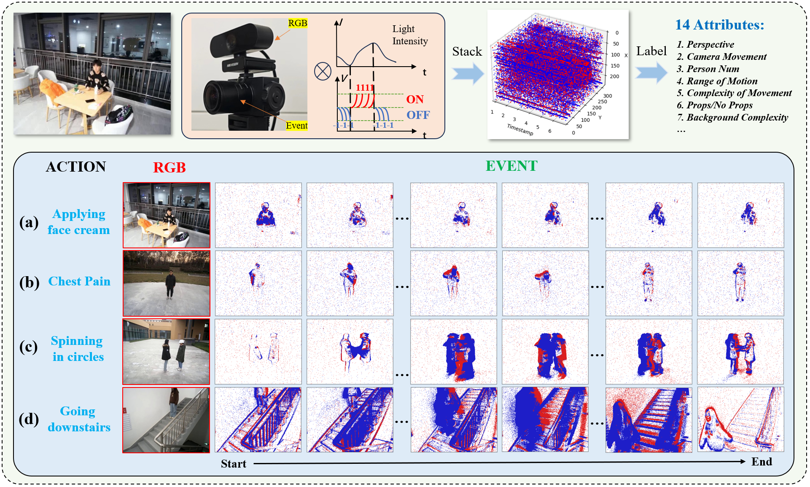
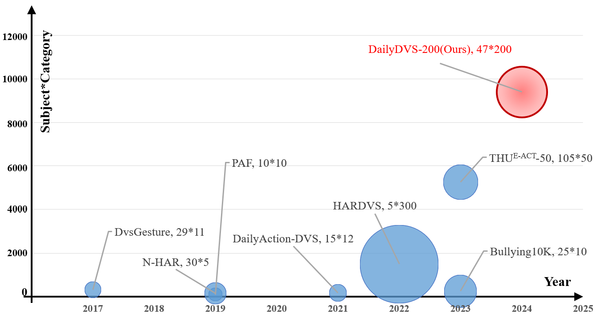
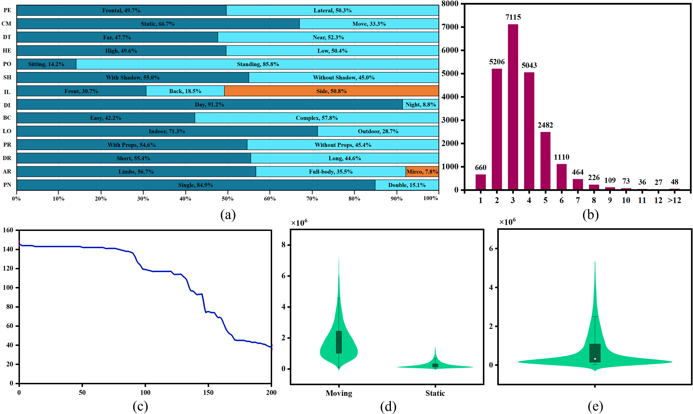

# DailyDVS-200: A Comprehensive Benchmark Dataset for Event-Based Action Recognition

### Baidu Netdisk: [[Datasets Link](xxx)][[Models Link](xxx)]
### Google Drive: [[Datasets Link](xxx)][[Models Link](xxx)]

:notebook_with_decorative_cover: Note: The related code and real datasets link will be made publicly available after the acceptance of the paper.

## Some Clips of DailyDVS-200:

<video width="1280" height="960" controls>
    <source src="video/demo.mov" type="video/mp4">
</video>

## OverView:

## Statistics:

## 14 Attributes:

## Eval results:

