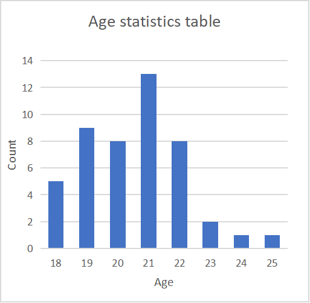
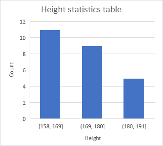
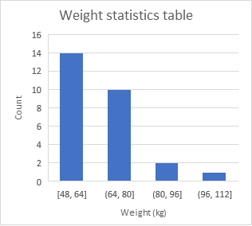
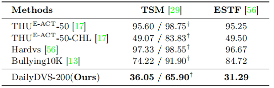

# DailyDVS-200: A Comprehensive Benchmark Dataset for Event-Based Action Recognition


## Abstract:
Neuromorphic sensors, specifically event cameras, revolutionize visual data acquisition by capturing pixel intensity changes with exceptional dynamic range, minimal latency, and energy efficiency, setting them apart from conventional frame-based cameras. The distinctive capabilities of event cameras have ignited significant interest in the domain of event-based action recognition, recognizing their vast potential for advancement. However, the development in this field is currently slowed by the lack of comprehensive, large-scale datasets, which are critical for developing robust recognition frameworks. To bridge this gap, we introduces **DailyDVS-200**, a meticulously curated benchmark dataset tailored for the event-based action recognition community. DailyDVS-200 is extensive, covering 200 action categories across real-world scenarios, recorded by 47 participants, and comprises more than 22,000 event sequences. This dataset is designed to reflect a broad spectrum of action types, scene complexities, and data acquisition diversity. Each sequence in the dataset is annotated with 14 attributes, ensuring a detailed characterization of the recorded actions. Moreover, DailyDVS-200 is structured to facilitate a wide range of research paths, offering a solid foundation for both validating existing approaches and inspiring novel methodologies. By setting a new benchmark in the field, we challenge the current limitations of neuromorphic data processing and invite a surge of new approaches in event-based action recognition techniques, which paves the way for future explorations in neuromorphic computing and beyond.


## DailyDVS-200 Dataset Description:

- `200` event-specific action categories
- `47` socially recruited subjects
- `22046` video recordings
- `DVXplorer Lite` event camera with a spatial resolution of `320x240`
- `14` attributes are labeled


## Action description:
200 action classes and detailed description can be seen in `./resource/action_description.csv`.

## Subjects Info:

Our subjects are students aged 18 to 25, who vary in height (158 cm to 190 cm) and weight (48 kg to 105 kg). The detail information can be seen in `./resource`.

<!-- <div>
    
    
    
</div> -->


## Testing set & Validation set:

In the DailyDVS-200 Dataset, the division of training,test and validation sets can be found in the `train.txt`, `test.txt`  and `val.txt`files. Each line consists of **Relative Path** and **Action ID**. The participants IDs responsible for collecting the testing set and validation set are as follows:
- Training set: `0,1,2,6,8,9,12,13,14,15,17,18,19,20,21,22,23,25,26,28,29,30,32,34,35,36,38,39,40,44,45,46`
- Testing set: `4,7,10,11,16,33,37,42,45`
- Validation set: `3,4,5,24,27,31,41,43`

If you want to do attribution test, select data with corresponding attributes from the above testing set as the dataset for attribute testing.


## Dataset Download:

 <br />

**"THU<sup>E-ACT</sup>-50 & THU<sup>E-ACT</sup>-50-CHL"**:see [THU<sup>E-ACT</sup>-50](https://github.com/lujiaxuan0520/THU-EACT-50)

**"Hardvs"**: See [HARDVS](https://github.com/Event-AHU/HARDVS)

**"Bullying10K"**: See [Bullying10K](https://www.brain-cog.network/dataset/Bullying10k/)

**"DailyDVS-200"**: See [Baidu Netdisk]()


## DailyDVS-200 Dataset Format:

In the DailyDVS-200 Dataset, we provide `all_data.json` file, which record the attributes of each data. An example are as follows:

```
{
    "FileName": "C0P3M0S1_20231111_09_11_23.aedat4",
    "Time": "20231111_09_11_23",
    "FilePath": ".../event_raw/11_11/3/C0P3M0S1_20231111_09_11_23.aedat4",
    "Scene": "1",
    "Action": "0",
    "Move": "0",
    "PersonNum": "1",
    "Range of Motion": "Limbs",
    "Complexity of Movement": "Easy",
    "Props/No Props": "No",
    "Indoor/Outdoor": "Indoor",
    "Background Complexity": "Easy",
    "Daytime/Nighttime": "Daytime",
    "Direction of Light": "Front Lighting",
    "Shadow": "No",
    "Standing/Sitting": "Standing",
    "Height": "Low",
    "Distance": "Near",
    "Perspective": "",
    "ID": "3"
}
```

In the DailyDVS-200 Dataset, which is provided in the .aedat4 format, the data is structured with 4 elements as follows:

- `t`: Represents the timestamp of the event.
- `x`: Represents the x-coordinate of the event.
- `y`: Represents the y-coordinate of the event.
- `p`: The polarity value. It contains three categories: 1 and 0. In our experiments, we  consider 1 as positive polarity and 0 as negative polarity.


## Environment for Training:

- Python 3.8

  - `conda create -n your_env_name python=3.8`

- torch 1.13.1 + cu116
  - `pip install torch==1.13.1+cu116 torchvision==0.14.1+cu116 torchaudio==0.13.1 --extra-index-url https://download.pytorch.org/whl/cu116 `

- Install `mmcv-full`
  
  - `pip install openmim chardet`
  - `mim install mmcv-full==1.7.0`
  
- Requirements

  - `pip install -r requirements.txt`

- Install `mmaction2`
  - `cd mmaction2`
  - `pip install -e .`


## Model Weights:


| Model | Top-1 Acc. | Top-5 Acc. | Model | Top-1 Acc. | Top-5 Acc. |
|:---------------------------:|:----------:|:----------:|:------------------------------------------------------------------:|:----------:|:----------:|
| [C3D]()    |   21.99   | 45.81 | [Timesformer]() | 44.25 | 74.03 |
| [I3D]()    |   32.30   | 59.05 | [Swin-T]() | **48.06** | 74.47 |
| [R2Plus1D]() |   36.06   | 63.67 | [ESTF]() | 24.68 | 50.18 |
| [SlowFast]() |   41.49   | 68.19 | [GET]() | 37.28 | 61.59 |
| [TSM]() | 40.87 | 71.46 | [Spikformer]() | 36.94 | 62.37 |
| [EST]() | 32.23 | 59.66 | [SDT]() | 35.43 | 58.81 |

## License
This dataset is licensed under the MIT License. Additionally, We have obtained explicit informed consent and au-thorization documentation from all participants involved in data collection.

## Acknowledgement :heart:
This project is based on  MMaction2 ([code](https://github.com/open-mmlab/mmaction2)),ESTF ([paper](https://arxiv.org/pdf/2211.09648), [code](https://github.com/Event-AHU/HARDVS?tab=readme-ov-file)),EST([paper](https://rpg.ifi.uzh.ch/docs/ICCV19_Gehrig.pdf),[code](https://github.com/uzh-rpg/rpg_event_representation_learning)),GET([paper](https://arxiv.org/abs/2310.02642),[code](https://github.com/Peterande/GET-Group-Event-Transformer)),SpikFormer([paper](https://arxiv.org/abs/2401.02020),[code](https://github.com/ZK-Zhou/spikformer)),SDT([paper](https://openreview.net/forum?id=9FmolyOHi5),[code](https://github.com/BICLab/Spike-Driven-Transformer)). Thanks for their wonderful works.

